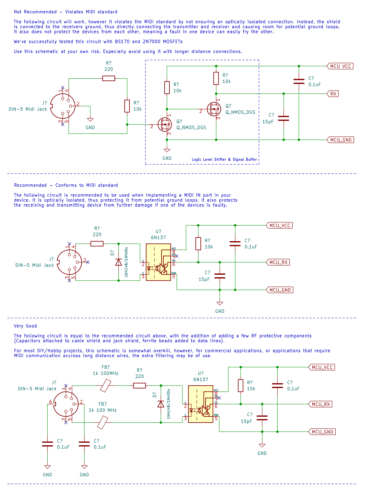
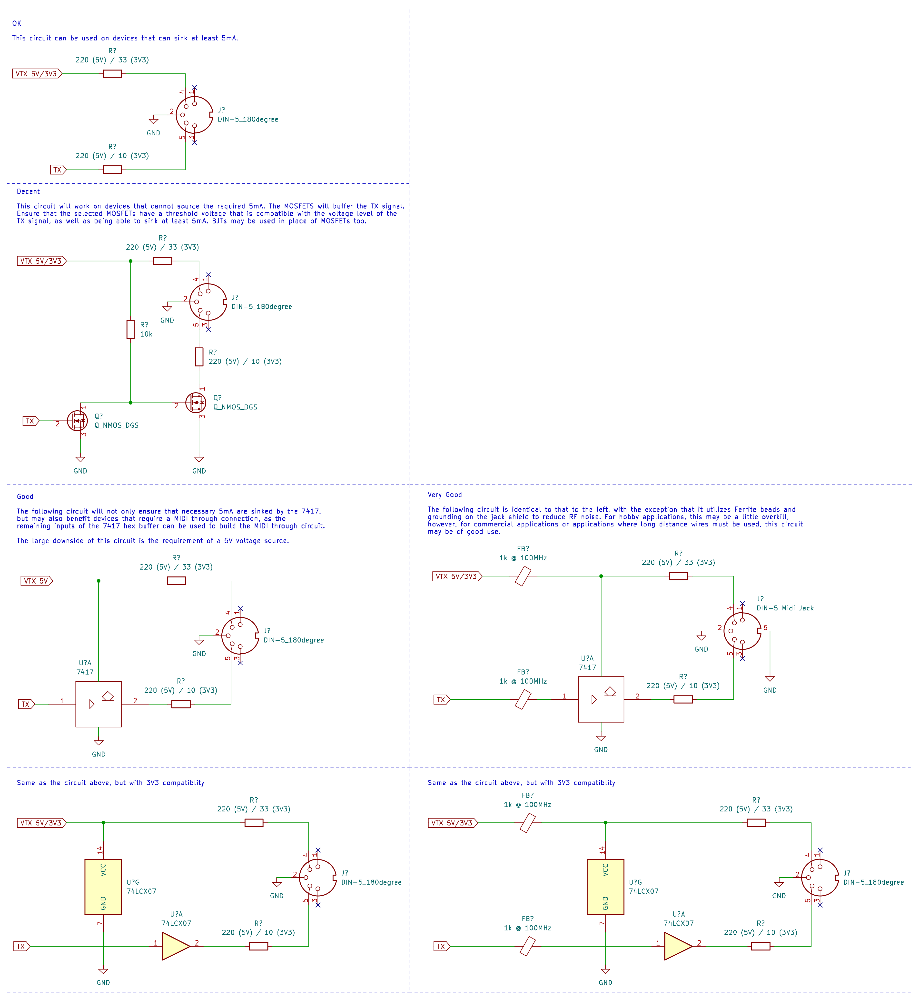
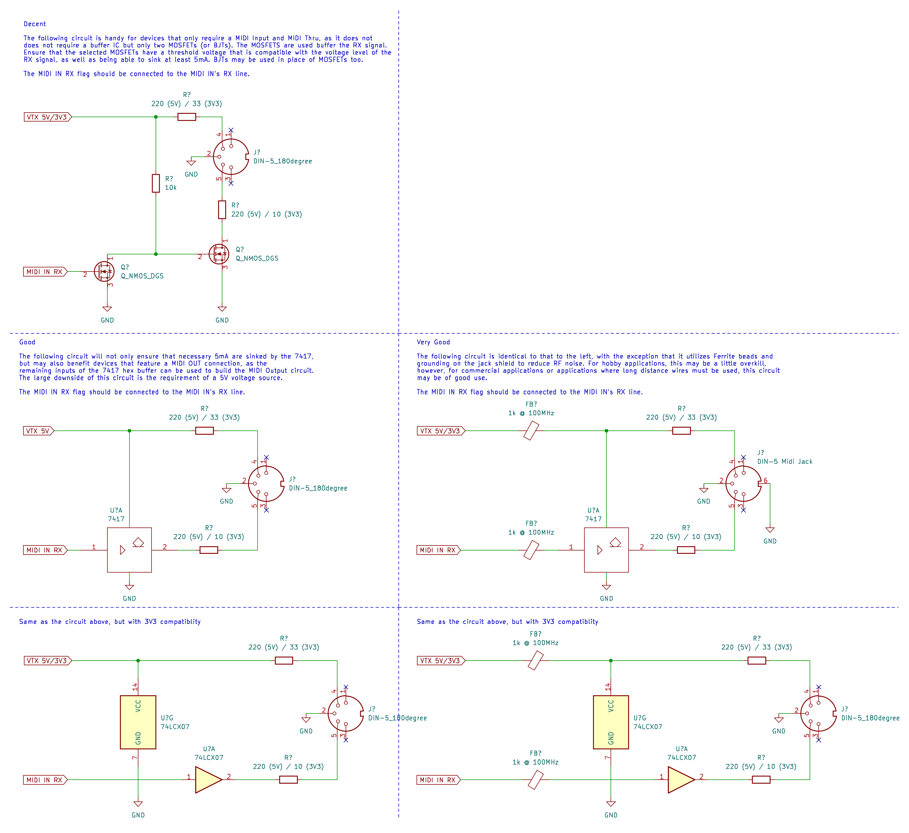

# KiCAD MIDI Templates

Welcome to our repository of KiCAD MIDI templates. The aim of this repository is to provide a set of template schematics that can be used to implement MIDI for your hardware.

> NOTE: This repository only contains template schematics! It does not contain any PCB layouts or footprint assignments.

The repository provides three KiCAD project directories:

 * [MIDI_IN](MIDI_IN) - Template Schematics to implement MIDI input
 * [MIDI OUT](MIDI_OUT) - Template Schematics to implement MIDI output
 * [MIDI THRU](MIDI_THRU) - Template Schematics to implement MIDI through

## Usage

Simply open the KiCAD project for your required template and select and copy the desired schematic to your KiCAD project. 

## Preview

 - [MIDI IN](#midi-in)
 - [MIDI OUT](#midi-out)
 - [MIDI THRU](#midi-thru)

### MIDI IN

### MIDI OUT

### MIDI THRU

